# Ransomware Analysis

## Check out the project presentation at https://radudilirici.github.io/reverse-engineering/.

## Summary

A pseudo-malicious ransomware is provided. Analyze it using any tools and methods you have learned until this point.

* The binary searches for files with a certain pattern and only encrypts those that match. Find out what the pattern is.
* Describe how the encrypted files are internally structured (what bytes are written in the encrypted files and how the encryption is done).
* Figure out how the file renaming process works and describe how decryption could theoretically be done.
* Create a program/script that decrypts any given encrypted file including the target file in the archive.

Link to the problem:

[https://cs.unibuc.ro/~crusu/re/Reverse%20Engineering%20(RE)%20-%20Project%200x01.pdf](https://cs.unibuc.ro/~crusu/re/Reverse%20Engineering%20(RE)%20-%20Project%200x01.pdf) 

Link to the binaries:

[https://pwnthybytes.ro/unibuc_re/asg1-files.zip](https://pwnthybytes.ro/unibuc_re/asg1-files.zip) 

In this process I used IDA Pro 7.0 on Windows 11 and GNU gdb 13.1 on Kali Linux.

## **Task 1:**

* The binary searches for files with a certain pattern and only encrypts those that match. Find out what the pattern is.

Starting with static analysis in IDA Pro we can observe that the main() function only calls one other function with the argument “.”. Therefore, we investigate sub_401C7F.

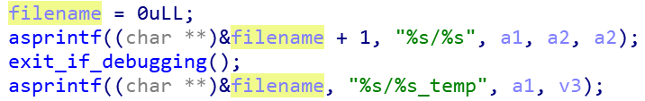

In sub_401C7F we can observe that there happens some kind of work with directories and files. We can also see that the only other method called here is sub_401BA5.

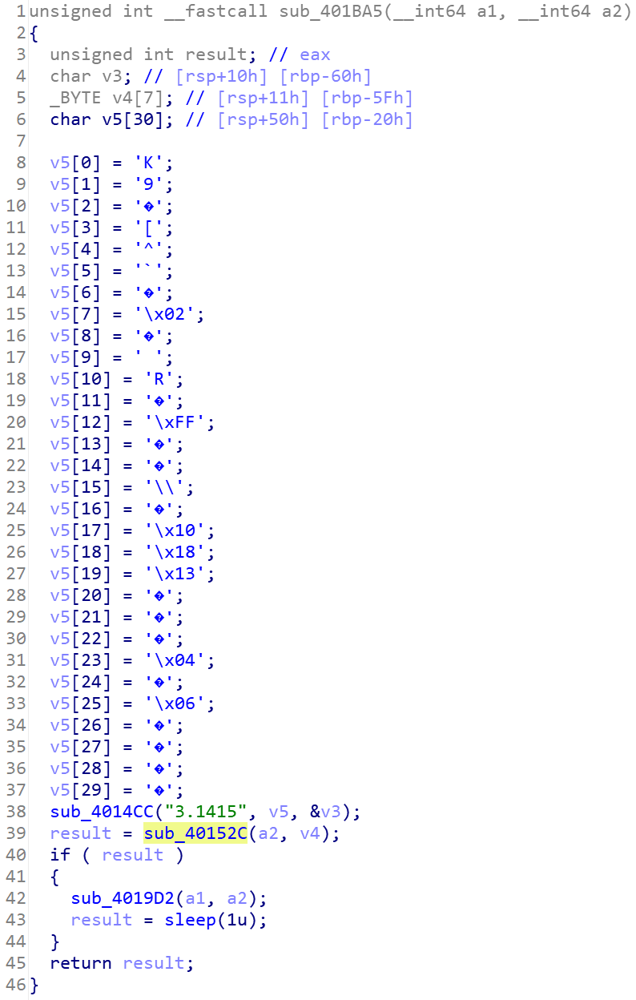

Entering sub_401BA5 we see many variables that are initialized. From the looks of it we can assume that this is actually a string. After transforming it to an array of characters it looks a little better, but the string itself doesn’t have any meaning.

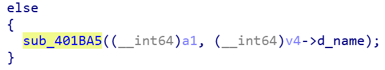

One interesting function here is sub_40152C because the rest of the method depends on its return value. At this point I also started using gdb in a Linux environment and observed that this function always returned 0 and the program did nothing, or at least nothing noticeable.

The sub_40152C function seems to work with two strings and it checks that the second one is a suffix to the first one.

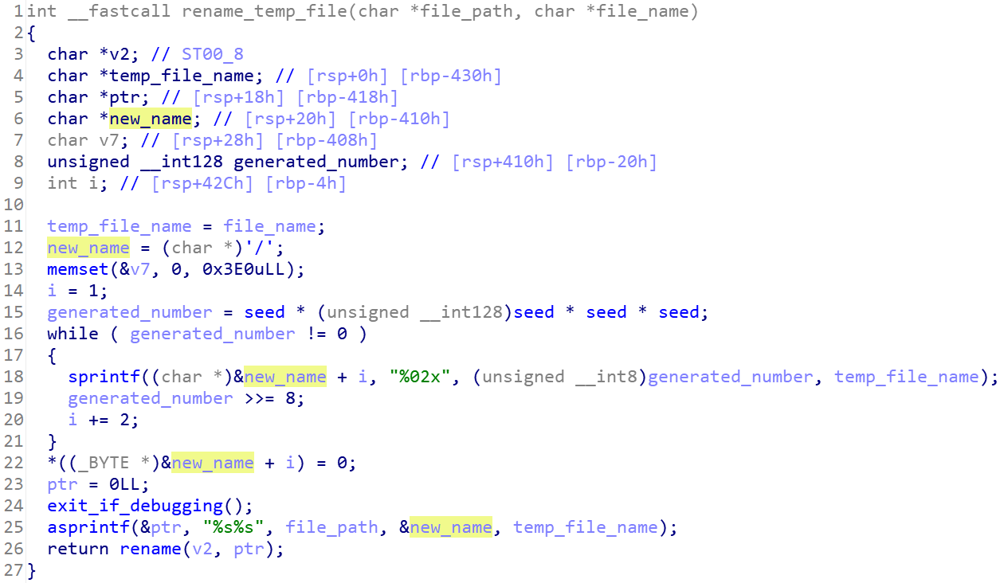

Inspecting this function with the debugger we notice a string that stands out in the memory of the program. That string is “encrypt_me_baby_one_more_time”.

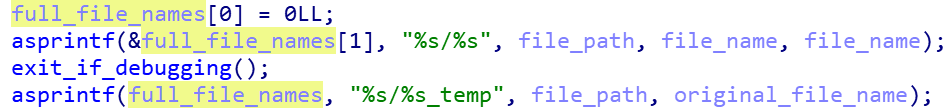

After some testing I confirmed that this is actually the string that is checked to be a suffix for the file to be encrypted. I placed several such files that satisfy this condition on the machine and noted that only the ones placed in the program’s folder or in a nested folder were being encrypted.

Analyzing the malware further I reached these conclusions:

* The function called by main (sub_401C7F) iterates through the files in the current location. If it finds a directory it navigates it recursively. We’ll call this function iterate_files.
* The sub_401BA5 function is responsible for checking if the found file satisfies the pattern required for encryption. It firstly initializes a string with strange characters. Because this string has the same length as the suffix (“encrypt_me_baby_one_more_time”) and because there is a method (sub_4014CC) called with it as its parameter, I assumed that it’s an encrypted version of the suffix. This means that sub_4014CC is responsible for decrypting it to the real string.

So, to this point, the flow of the malware is:

1. Search for all the files in the current directory and its subdirectories, starting from where the program is called (this is why the iterate_files function is called with the “.” argument). If the program is in folder A, but we start it via the command line from folder B, it will start searching for files in the B folder.
2. For each file, compute the secret string and check if it’s a suffix to the file name.
3. If it satisfies this condition, enter the sub_4019D2 function with the (relative) path and name of the file as arguments. We’ll call this function encrypt_file.

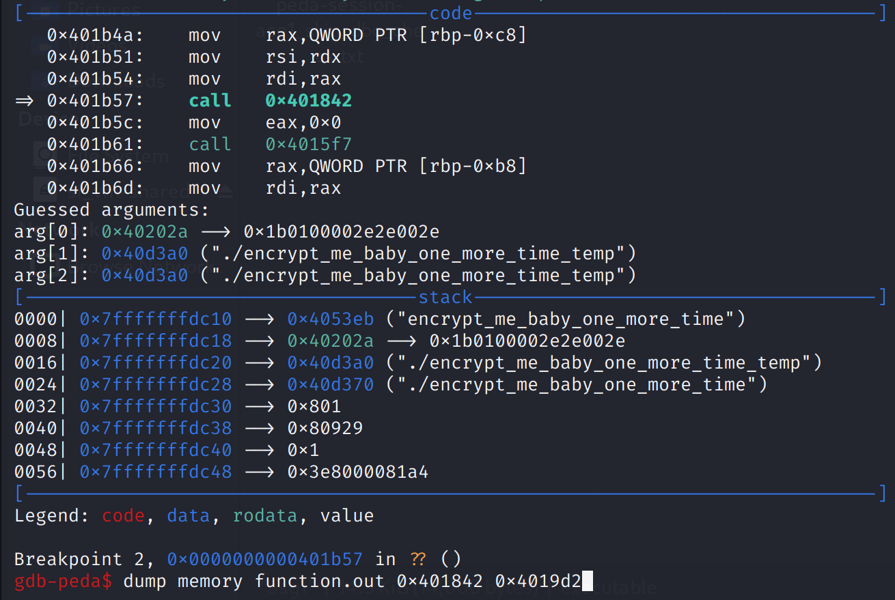

All the changes in the code can be seen in the final IDA file.

## Task 1 answer:

The program searches for files in the current directory and all its subdirectories. Then, it encrypts only the ones that have the suffix “encrypt_me_baby_one_more_time”.

 

## Task 2:

* Describe how the encrypted files are internally structured (what bytes are written in the encrypted files and how the encryption is done).

While analyzing the program in the Linux environment, I noticed that it always crashes when running it in debug mode. This means that there is some anti-debugging mechanism inside the program.

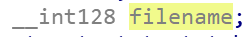

Indeed, entering the encrypt_file function we notice a method that is called quite a few times (6 to be precise, and it’s also called in lots of other places). That function is sub_401593. If we look inside it we discover that it uses ptrace to avoid debugging. This is because a program can only be traced by one process at a time. We’ll call this function exit_if_debugging.

Changing the response of ptrace while doing the dynamic analysis, so the program would “think” that it’s not being traced by someone else, would not be a viable solution, as we’d have to do this lots and lots of times. To counter this, I applied a patch to the binary and skipped the check altogether.

The original program was going through a loop 1000 times, but only checked for an external debugger only the first time. This was probably done to make it harder to bypass the mechanism dynamically.

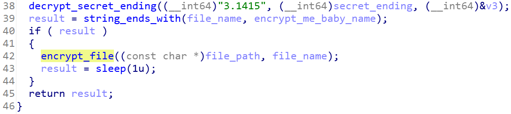

Taking a look in the assembly code we see that i is compared to 999 (0x3E7 in HEX) and if it’s less or equal (jle) it jumps to the body of the loop. I changed this instruction to jg, so it does the exact opposite. Now, it will execute the inside of the loop only if i > 999, which will be false from the first iteration (since i starts as 0). This results in not entering the loop and never checking for the debugger.

Before the patch:

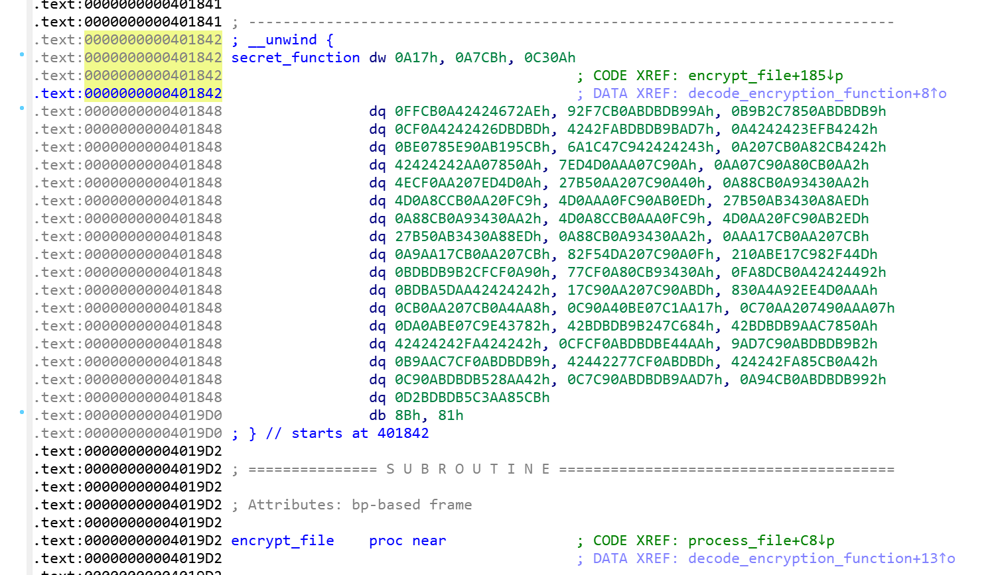

After the patch:

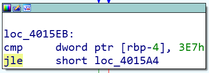

And the new corresponding pseudocode:

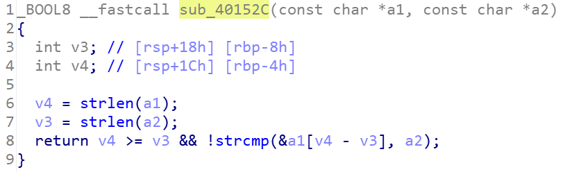

The encrypt_file method opens two files. One in read mode and one in write mode. IDA used just one 128 bit variable for both file names. These should be two separated strings, but IDA combined them because they were placed successively.

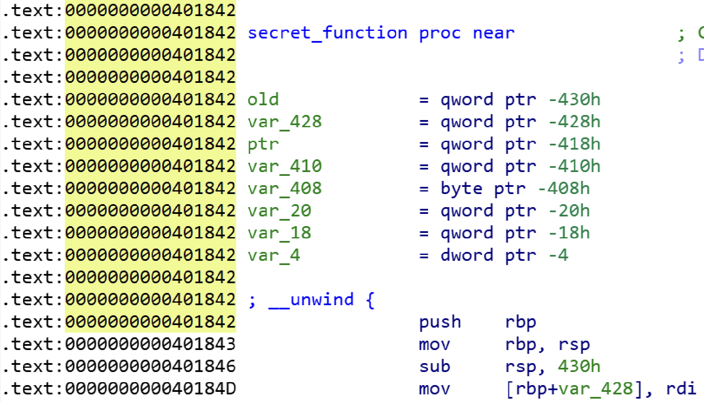

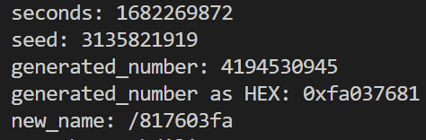

Although, it uses an array instead of two variables, this would be a better interpretation of the code:

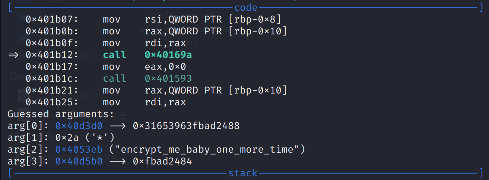

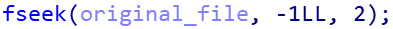

Using dynamic analysis and placing several breakpoints inside this function we notice that the encryption takes place in two steps. First, a new file called &lt;filename>_temp is created, where &lt;filename> is the name of the original file. Then, the malware writes to this new file the encrypted contents of the original file. Lastly, the temporary file is renamed. This could not have been observed only by running the program, as the whole process is usually instantaneous.

Based on our current knowledge, this is a summary of the encrypt_file function:

1. A random seed is generated based on the current time and a constant (0xDEADBEEF). We don’t know what it’s used for at this point.
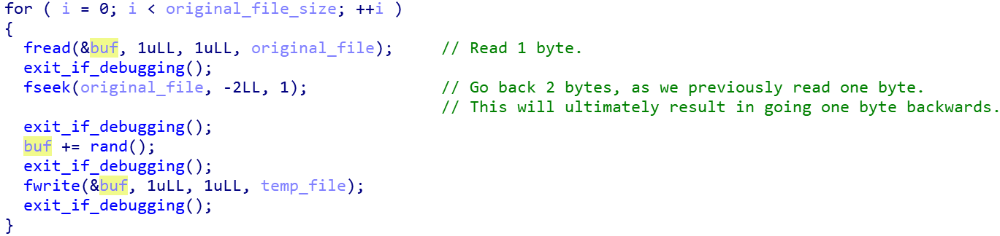

2. The function xstat is called for the original file. This provides information about the file. Only the file size is extracted from this call. Actually, another function named sub_401E00 is called, which is a wrapper for xstat. I named it get_file_status.
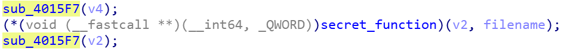

3. The original file is opened in read mode (full_file_names[1] in the previous picture) and the temporary file is opened in write mode (full_file_names[0], having the &lt;filename>_temp name).
4. A function named sub_40169A is called.
5. The two files are closed. At this point the temporary file already has all the content inside it. Again, I observed this by placid breakpoints inside the debugger and checking the status of the files. From this we can deduce that sub_40169A handles the encryption of the file.
6. The sub_4015F7 method is called.
7. The method word_401842 is called. When opening this function inside IDA, we can’t actually read its contents. Instead, we can only see some random data. But, by analyzing it dynamically we can observe that after the call, the temporary file no longer exists and instead a new file with a cryptic name appears. For now I renamed it to secret_function.
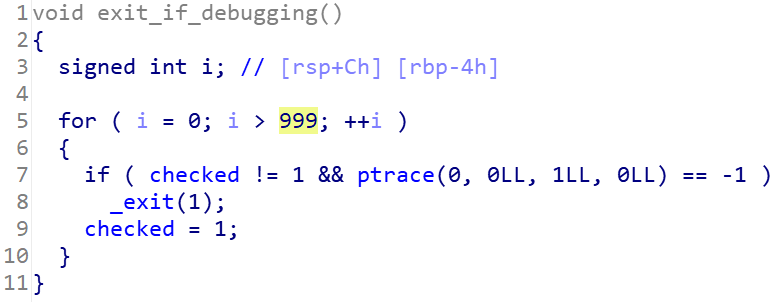

8. The sub_4015F7 function is called again.
9. The original file is deleted. This is an observation of dynamic analysis.

The sub_40169A function seems to be the target of our current task so we’ll take a look at it. We’ll also rename it to encrypt_to_temp_file.

Setting a breakpoint in gdb just before calling it, we actually get a hint for the passed parameters.

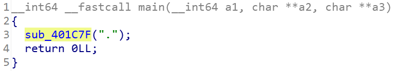

After further analyzing the code and how these parameters are used I concluded that they are, in order:

* A pointer to the original file.
* The size of the original file. In this case 0x2a, which is 42 in decimal.
* The name of the original file.
* A pointer to the temporary file.

There are three for loops in this method, each writing some text inside the temp file. I wasn’t actually able to observe these writing operations in real time because the buffer was not flushed, but these are my guesses:

1. The position of the input stream is placed one byte before the end of the file. This is done so the next read operation results in getting the last byte.
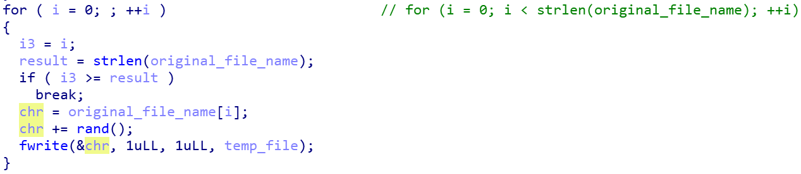

2. The method goes through the original file byte by byte, backwards. For each read byte a random value is added to it. Then, this new byte is written to the temporary file.
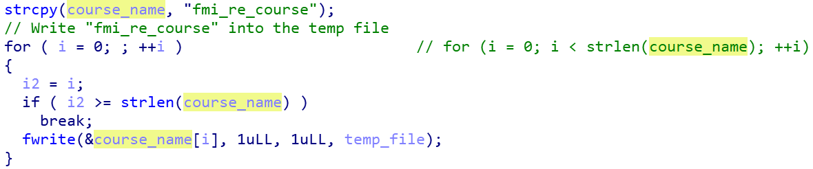

3. The string “fmi_re_couse” is written to the temporary file.
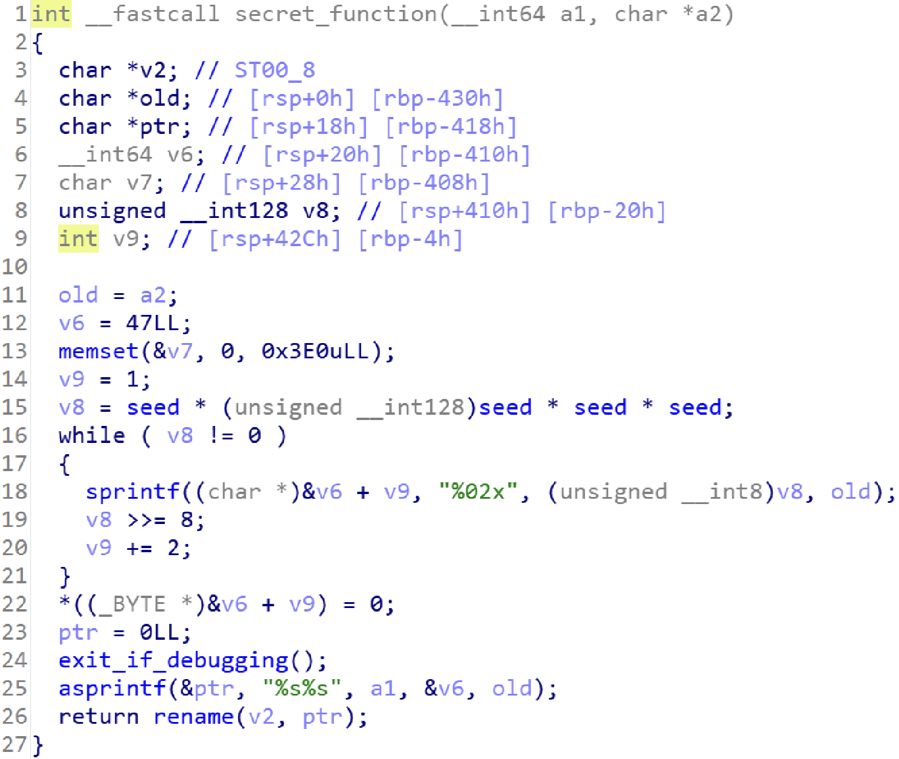

Using this information I could confirm that the first part of the encrypted file is indeed a byte to byte correspondence to the original one. I ran the malware on files of different sizes and noticed that the number of characters before “fmi_re_couse” was the same as the number of characters of the original file.
4. The function goes through the name of the original file. It adds random values to each of the characters and writes the new values to the temporary file, just like in the first loop.
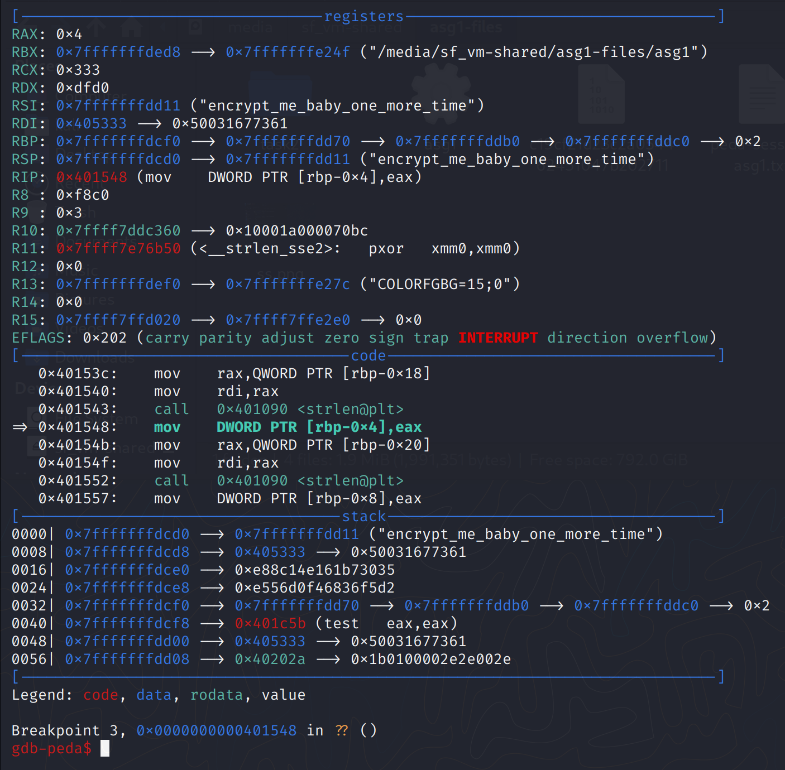

For now, we can’t possibly decrypt this new file as all its bytes are basically random.

## Task 2 answer:

The encrypted file consists of three parts. The first one represents the contents of the original file, but each byte has a random value added to it. The second one is the “fmi_re_couse” string. The last part represents the name of the original file, but each byte has a random value added to it, just like in the first part.

 

## Task 3:

* Figure out how the file renaming process works and describe how decryption could theoretically be done.

There are two more functions inside encrypt_file that we did not cover. We can’t read the contents of secret_function, so we’ll analyze sub_4015F7.

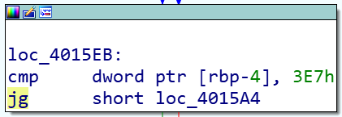

This method sets the access permissions to READ + WRITE + EXECUTE (7 as the numerical value) to a memory region. It then traverses the memory region of secret_function and applies a XOR operation to it. The memory is read 2 bytes at a time and each chunk is XORed with 0x42 (66 in decimal). We can see that it only affects this function because the iteration stops when reaching encrypt_file, which is the next function in the code of the program.

From this, we can deduce that secret_function is initially encrypted and this function decrypts it. It then encrypts it back after using the secret function. We’ll call this function un_hide_secret_function.We want to apply this decryption on the original binary, so we can statically analyze the method.

To achieve this, I ran the malware in debug mode and set a breakpoint just before the secret function was called. With the method decrypted in memory, I dumped its contents to a file. I then wrote a script that replaces the encrypted memory zone with the bytes I previously dumped, i.e. the decrypted function.

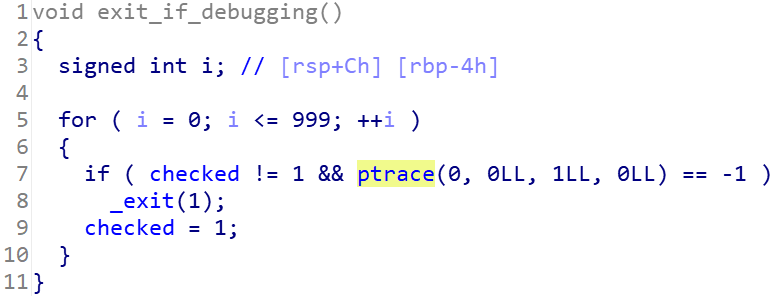

I executed the script inside IDA and specified that it’s a function. It then recognized it as a method.

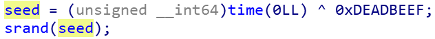

This is the resulting function:

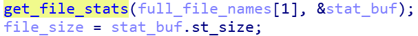

And this is the function after some renaming:

I wasn’t entirely sure of the result of this function, so I simulated it by writing a simple C program (renaming.c). The new_name string is the generated_number interpreted as a hexadecimal, written backwards one byte at a time (two hex digits). 

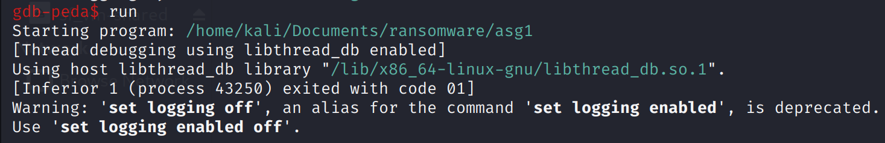

This process is reversible. From the name of the file we can get the generated_number. And from this we can get the seed by computing the fourth root of generated_number. Note: seed is unsigned, thus always positive.

## Task 3 answer:

The name of the encrypted file is computed from the generated seed. Then, seed to the power of 4 is stored in another variable. This new value is interpreted in hexadecimal and is used for the new name. Lastly, the bytes are reversed.

To decrypt the file we should:

1. Compute the seed using the described process.
2. Use this seed to initialize the random number generator.
3. Go through the first portion of the file (until the “fmi_re_course” string) and apply the reverse of the encryption procedure. This means reading the bytes, subtracting a random value from them (we should be getting the same random values as the ones in the encryption process, since the seed is the same) and writing to them backwards. We have to read them in the right order, so we use the same random values as in the encryption.**Note**: According to some info I found online, we should also write this program in C, as the rand function might return different values when using other programming languages, even when using the same seed. Furthermore, even the compiler has to be the same in order to guarantee that the rand will return the same values.
4. Skip the “fmi_re_course” string and subtract the remaining pseudo random values from the rest of the file to restore the original file name.

 

## Task 4:

* Create a program/script that decrypts any given encrypted file including the target file in the archive.

I created several programs to achieve this. These are 1_get_info.py, 2_decrypt.cpp and 3_reverse_file.py.

The first one is a script that computes the seed and finds the position of the “fmi_re_course” string in the file. The second functionality worked for my test file, but not for the one in the assignment. I found this value by manually inspecting the binary file.

The second program is responsible for decrypting the file. I hardcoded the name of the input file and the information generated by the previous Python script. It also prints the original name of the encrypted file. The problem with this program is that it does not reverse the contents of the file.

Because I did not find a simple solution to reversing the file on the go inside the C++ program, I created another script for doing exactly this.

Running these three steps seemed to work on some files, but not on the one given in the assignment. I found the name of the original file, which is target_file.encrypt_me_baby_one_more_time and the file seemed to be a PNG image. But the resulting file was corrupted. I checked and even the header had one wrong byte. I tried to fix it by changing that particular byte, but it did not work. There must be more mistakes inside the file.
